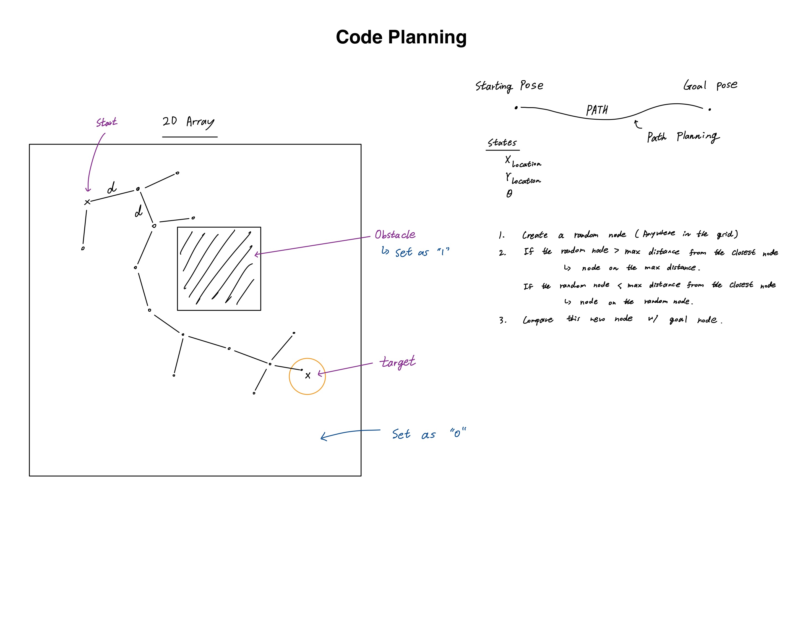

# Path Planning - RRT Algorithm
## What is RRT Algortithm?
**Rapidly Exploring Random Tree (RRT)** is an popular algorithm used in motion planning and robotics, designed to efficiently search nonconvex, high-dimensional spaces by randomly building a space-filling tree.

## How Does the RRT Algorithm Work?
1. *Establish* the **initial configuration or state**, representing the starting position.
2. *Generate* a **random state** within the configuration space.
3. *Locate* the **nearest node (state) in the existing tree** to the randomly selected state:
    - IF the randomly selected state is outside the specified boundaries (step size), advance to the maximum step in the direction of the randomly selected state.
    - IF any barriers or obstacles are encountered, navigate to the closest point in the direction of the randomly selected state.
4. Add the new state as a node to the tree, and create an edge between the new state and its nearest neighbor.
5. Following the addition of each new state to the tree, verify if the new state lies within a certain threshold of the goal state.
    - IF the new state falls within the defined threshold of the goal, the algorithm concludes, and the path from the start state to the goal state can be extracted from the tree.
    - IF not, repeat the process until the goal state can be successfully extracted.

## Code Planning

## Sources
- Education (Learn how RRT works):
    - "Rapidly-Exploring Random Trees: Progress and Prospects" by S. Lavalle (Iowa State University)
    - ChatGPT
- Examples (Learn how to implement RRT):
    - "Motion Planning: Rapidly Exploring Random Trees (RRT): Algorithm Implementation Step by Step!" by VDEngineering in YouTube